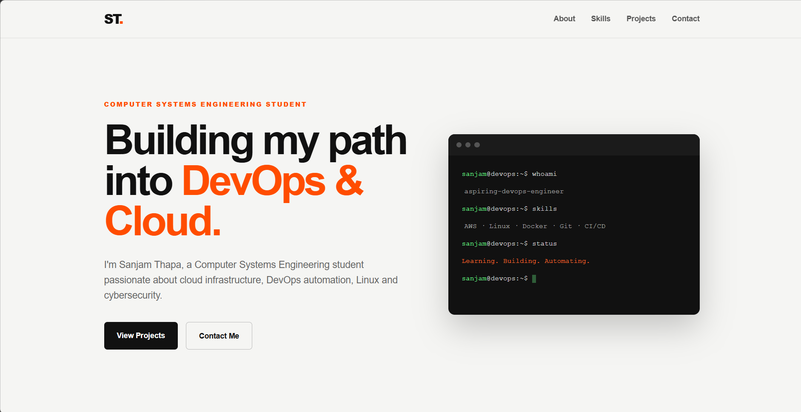

# Containerized DevOps Portfolio

This project is a personal portfolio website that I built and then
containerized to practice DevOps concepts.

The main purpose of this project is to understand how a web application
can be developed, containerized with Docker, served using Nginx, and
automatically tested using GitHub Actions.

## About the Project

The website is built using HTML and CSS. Instead of running the website
directly on a local machine, I packaged it into a Docker container and
used Nginx as the web server.

I also created a Docker Compose configuration to make running the
application easier and added a health check to make sure the web server
is responding correctly.

GitHub Actions is used to automatically build and test the Docker image
whenever changes are pushed to the main branch.

## Project Preview



## Live Demo

[View the live portfolio](https://devops-portfolio-ymuy.onrender.com)

## Technologies Used

This project uses the following technologies and tools:

- HTML5 and CSS3 for the website
- Nginx as the web server
- Docker for containerization
- Docker Compose for managing the container
- Linux for the development environment
- Git and GitHub for version control
- GitHub Actions for Continuous Integration
- Trivy for Docker image vulnerability scanning

## CI/CD Pipeline

The project uses GitHub Actions to automatically validate every change pushed to the repository.

The pipeline:

1. Checks out the source code.
2. Builds the Docker image.
3. Scans the image for HIGH and CRITICAL vulnerabilities using Trivy.
4. Runs the Docker container.
5. Tests the application using HTTP.
6. Removes the test container after the workflow finishes.

This helps ensure that changes are automatically tested before they are considered ready.

## Deployment

The application is containerized using Docker and served through Nginx. The Docker container is deployed as a web service on Render.

The deployment process uses the following flow:

GitHub → GitHub Actions → Docker Build → Trivy Scan → Application Test → Render Deployment

## Features

- Responsive personal portfolio website
- Clean HTML and CSS based design
- Nginx web server
- Dockerized application
- Docker Compose configuration
- Container health check
- Nginx security headers
- `no-new-privileges` security setting
- `.dockerignore` for a cleaner Docker build
- Automated Docker image building
- Trivy vulnerability scanning
- Automated website testing with GitHub Actions
- Continuous Integration pipeline

## Project Architecture

```text
Developer
    |
    v
GitHub Repository
    |
    v
GitHub Actions
    |
    +---- Build Docker Image
    |
    +---- Scan Image with Trivy
    |
    +---- Run Container
    |
    +---- Test Website
    |
    v
Docker Container
    |
    v
Nginx
    |
    v
Portfolio Website